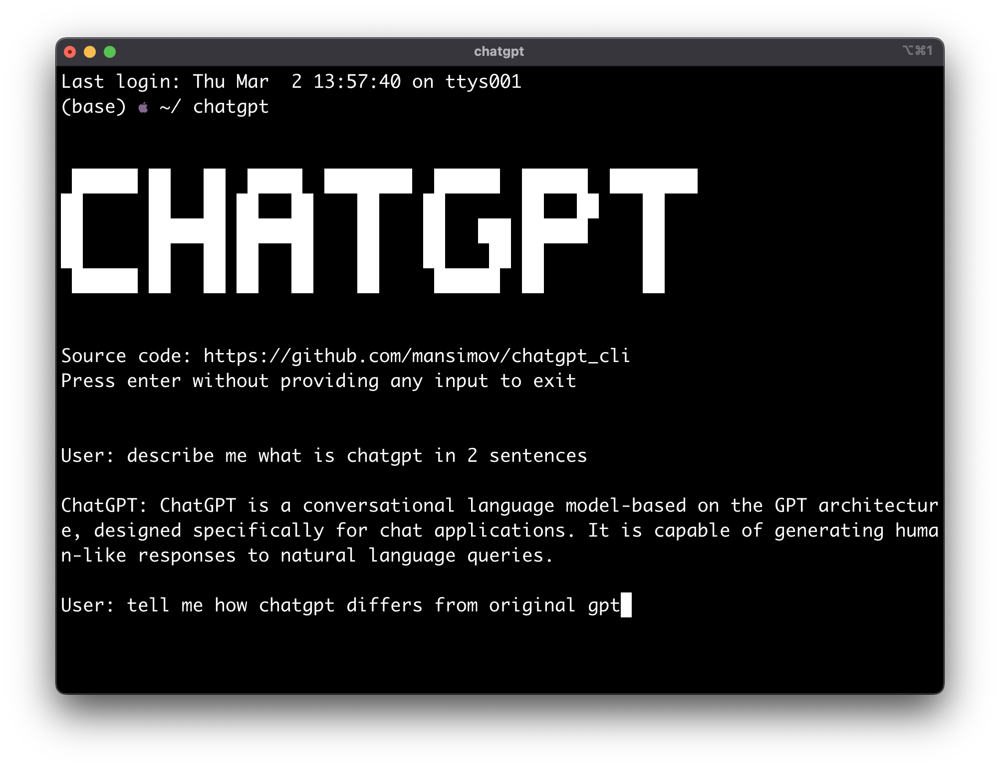

# ChatGPT In Your CLI

Lightweight wrapper of the official ChatGPT API in your terminal.

## Demo



## Installation

Run the following

```
git clone https://github.com/mansimov/chatgpt_cli
bash install.sh
```

Make sure to set your OpenAI API key in `OPENAI_API_KEY` environment variable

Also install [`jq` library](https://stedolan.github.io/jq/download/) (json data processor in shell) if you don't have it.

After that open a new terminal window and run `chatgpt` command

## License

MIT
